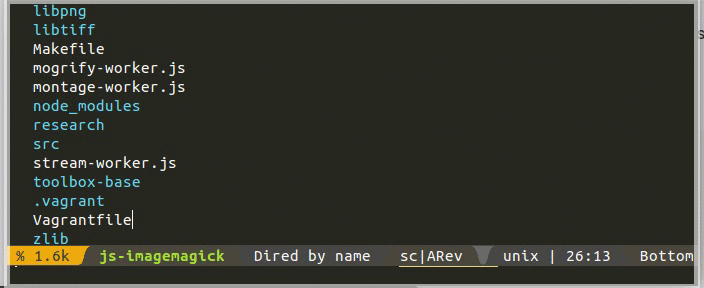
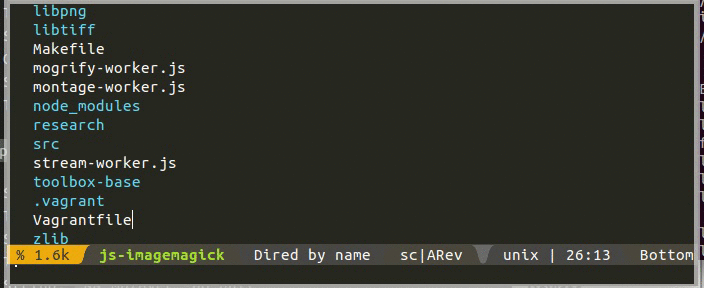

#Vagrant TRAMP

## Synopsis

`vagrant-tramp` adds an Emacs
[TRAMP](http://www.gnu.org/software/tramp/) method for
[Vagrant](http://vagrantup.com/) boxes.  As far as Vagrant is
concerned, the TRAMP `vagrant` method behaves like the built-in
`vagrant ssh` command does.  The `vagrant-tramp` method simply
provides auto-completion and a wrapper around `vagrant ssh` for
connecting to boxes.

## Installation

If you have a recent Emacs with `package.el`, you can install
`vagrant-tramp` from [MELPA](http://melpa.milkbox.net/).

Or via [el-get](http://tapoueh.org/emacs/el-get.html)

Otherwise add it to your emacs `load-path`.

## Usage

The TRAMP method `vagrant` uses `vagrant global-status` to get a list
of running Vagrant boxes for completion:

<kbd>C-x C-f /vagrant:</kbd>

Boxes are named using the `Vagrantfile` directory basename and the VM
name (excluding *default*) to support multi-VM environments. TRAMP
opens a connection by `cd`-ing into the `Vagrantfile` directory and
running `vagrant ssh $box_id`.

### Opening a file as root

Use this [trick](http://www.emacswiki.org/emacs/TrampMode#toc10) from
the Emacs Wiki, where we replaced "ssh" with "vagrant" and where "box"
is a Vagrant box name:

    C-x C-f /vagrant:box|sudo:box:/path/to/file RET

### vagrant-tramp-term

The `vagrant-tramp-term` function provides a convenient way to
`vagrant ssh` into a box using an ansi-term.

<kbd>M-x vagrant-tramp-term</kbd>

## See also

* [vagrant-el](https://github.com/ottbot/vagrant.el)
